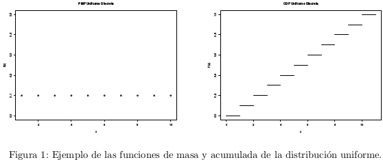

\begin{table}[ht]
\centering
\begin{tabular}{c}
\textbf{Maestría en Computo Estadístico}\\
\textbf{Inferencia Estadística} \\
\textbf{Tarea 1}\\
\today \\
\emph{Enrique Santibáñez Cortés}\\
Repositorio de Git: \href{https://github.com/Enriquesec/Inferencia_Estad-stica/tree/master/Tareas/Tarea_1}{Tarea 1, IE}.
\end{tabular}
\end{table}
\begin{itemize}
\item[1.] La compañía CIE ha desarrollado un nuevo producto. La demanda de tal artículo es desconocida, pero se asume que es una variable aleatoria distribuida uniformemente en $\{0, 1, \cdots, N \}$.
Los dispositivos deben de ser hechos por adelantado; cada uno vendido produce una ganancia de $g$ pesos y cada uno de los que se queda sin vender produce una perdida de $p$ pesos.
¿Cuántos de estos artículos tienen que producirse para maximizar la ganancia esperada?

\res
Sea $X$ la demanda del nuevo producto, entonces la función de densidad es: 
\begin{equation*}
f(x) = \left\{\begin{array}{ll}
\frac{1}{N+1}& \text{para } X\in\{0,1,\cdots , N\}\\
0 & \text{en otro caso} 
\end{array} \right.
\end{equation*}
Sea r el número de dispositivos hechos por adelantado, $g>0$ y $p>0$,definamos a la función ganancia como:
\begin{equation*}
G = \left\{\begin{array}{ll}
gX-(r-X)p & \text{para } X\leq r\\
gr & \text{para } X>r
\end{array} \right.
\end{equation*}

Ahora podemos calcular la esperanza de $G$:
$$\mE[G]=\mE[[gX-(r-X)p]\cdot I_{\{X\leq r \}}+gr\cdot I_{\{X >r\}}] $$
$$\mE[G]=g\mE[X\cdot I_{\{X\leq r \}}]-rp\mE[\cdot I_{\{X\leq r \}}]+p\mE[X\cdot I_{\{X\leq r \}}]+gr\mE[\cdot I_{\{X >r\}}] $$
Debido a que $X\sim U(0,N)$, entonces $\mE(X\cdot I_{\{X\leq r \}})=\frac{r(r-1)}{2(N+1)}$, $\mE[I_{\{X\leq r \}}]=\mP(X<r))$ y $\mP(X<r)=\frac{r}{N+1}$. Utilizando lo anterior y algunas propiedades básicas de la esperanza podemos desarrollar la esperanza como 
$$\mE[G]=\left( \frac{g(r^2-r)}{2(N+1)}-\frac{pr^2}{N+1}+\frac{p(r^2-r)}{2(N+1)}\right)+gr \cdot\left[1- \frac{r}{N+1} \right]$$

$$\mE[G]= \left( \frac{g(r^2-r)}{2(N+1)}-\frac{pr^2}{N+1}+\frac{p(r^2-r)}{2(N+1)}\right)+gr -\frac{gr^2}{N+1}.$$

Simplificando la expresión anterior y derivando $\mE [G]$ con respeto a $r$ tenemos 
$$\mE'[G]= \frac{2gr-g}{2(N+1)}+\frac{-2rp}{N+1}+\frac{2pr-p}{2(N+1)}+g+\frac{-2gr}{N+1}.$$

Igualando a 0 y despejando $r$ tenemos
\begin{equation*}
\begin{array}{rcl}
\frac{2gr-g}{2(N+1)}+\frac{-2rp}{N+1}+\frac{2gr-p}{2(N+1)}+g+\frac{-2pr}{N+1}&=&0\\
&&\\
2gr-g-4rp+2pr-p+2g(N+1)-4gr&=&0\\
&&\\
-2gr+g-2rp-p+2gN&=&0\\
&&\\
-2r(p+g)&=&-g-2gN+p\\
&&\\
r&=&\frac{g+2gN-p}{2(p+g)}
\end{array}
\end{equation*}

Ahora usando el criterio de segunda derivada para determinar que el punto crítico encontrado sea un máximo/mínimo, calculemos la segunda derivada de la esperanza de la función de las ganancias:
$$\mE''[G]=\frac{-p}{N+1}+\frac{-g}{N+1}.$$
Como $p, g, N>0$ por como se definieron desde el principio del problema, implica que $\mE''[G]<0$ y que $r$ en $\frac{g+2gN-p}{2(p+g)}$ es un máximo. \\
Por lo tanto cuando se producen $\frac{g+2gN-p}{2(p+g)}$ artículos  la ganancia esperada se maximiza.\ \ \ \ \fin 

2. Un conjunto de bits se envían sobre un canal de comunicación en paquetes de 12. Si la probabilidad de que un bit sea corrompido sobre este canal es 0.1 y los errores son independientes,
¿cuál es la probabilidad de que no más de dos bits de un paquete se corrompan? Si 6 paquetes
de bits se envían sobre el canal, ¿cuál es la probabilidad de que al menos un paquete contenga 3 o más bits corruptos? Finalmente, si $X$ denota el número de paquetes conteniendo 3 o más bit corruptos, ¿cuál es la probabilidad de que $X$ excederá su media por más de dos desviaciones estándar? 

\res
Sea $Y$ el número de bits que son corrompidos en este canal dentro de un paquete de 12, entonces podemos decir que $Y\sim \ Bin(12,0.1)$. Por lo que \textbf{la probabilidad de que no más de dos bits de un paquete se corrompan es} (ocupando la función \textsf{pbinom(q=2, size=12, prob = 0.1)} en el software estadístico R.):
$$\mP(Y\leq2)= \mP(Y=2)+\mP(Y=1)+\mP(Y=0)=\sum_{y=0}^2{12 \choose y}(0.1)^y(0.9)^{12-y}=0.88913.$$
Ahora si existen 6 paquetes de bits sobre el canal, para determinar la probabilidad de que al menos un paquete contenga 3 o más bits corruptos, primero calculemos la probabilidad de que un paquete contenga 3 o más bits, la cual esta dada como 
$$\mP(Y\geq3) = 1-\mP(Y<3)=1-0.88913= 0.11087.$$
Ahora, sea $X$ el número de paquetes que contienen 3 o más bits corruptos de n paquetes existentes. Por definición podemos decir que $X\sim Bin(n,p)$, donde $p$ es la probabilidad de que un paquete tenga 3 o más bits corruptos. Por lo que para este problema $n=6$ y $p=0.1107$ y $X\sim Bin(6,0.11087),$ entonces \textbf{la probabilidad de que al menos un paquete contenga 3 o más bits sería}
$$\mP(X\geq1)=1-\mP(X<1)=0.5059265.$$
Ahora, para calcular la probabilidad de que $X$ exceda su media por más de dos desviaciones estándar primero calculemos la media y la desviación estándar. Como $X$ es una distribución binomial tenemos que 
$$\mE(X)=np=6*0.11087=0.66522.$$
$$\sigma=\sqrt{var(X)} =\sqrt{np(1-p)}=\sqrt{6*0.11087(1-0.11087)}=0.769069.$$
Por lo que \textbf{la probabilidad de que $X$ exceda su media por más de dos desviaciones estándar es}
$$\mP(X>np+2\sqrt{np(1-p)})=\mP(X>0.66522+2(0.769069)=\mP(X> 2.203358).$$
Por ser una variable discreta en los enteros positivos, podemos utilizar que:
$$\mP(X> 2.203358)=\mP (X\geq 3)=1-\mP(X\leq2)=0.02104176 \ \ \finf$$

3. Una caja contiene 12 manzanas frescas y 4 que están podridas. Si elige 3 al azar y X denota el
número de manzanas frescas que tomó, encuentre la función de densidad de X y su esperanza.

\res 
Por definición de X, podemos decir que $X\sim Hyper(n=3, M=12, N=16)$. Por lo que podemos decir que la función de densidad es :
\begin{equation*}
f(x)= \frac{{M\choose x}{N-M\choose n-x}}{{N\choose n}}\ \ \text{para } x\in \{0,1,2,3\}.
\end{equation*}
Calculemos los valores exactos de la función de densidad (ocupando la función \textsf{dhyper(x=c(0,1,2,3), m=12, n=4, k=3)}:
\begin{itemize}
\item para $x=0$,
$$f(0)=\frac{{12\choose 0}{4\choose 3}}{{16\choose 3}}= 0.007142857.$$
\item para $x=1$,
$$f(1)=\frac{{12\choose 1}{4\choose 2}}{{16\choose 3}}= 0.128571429.$$
\item para $x=2$,
$$f(2)=\frac{{12\choose 2}{4\choose 1}}{{16\choose 3}}= 0.471428571.$$
\item para $x=3$,
$$f(3)=\frac{{12\choose 3}{4\choose 0}}{{16\choose 3}}= 0.392857143.$$
\end{itemize}
En conclusión \textbf{la función de densidad de $X$ es}: 
\begin{equation*}
f(x) = \left\{\begin{array}{ll}
0.007142857 & \text{para } x=0\\
0.128571429 & \text{para } x=1\\
0.471428571 & \text{para } x=2\\
0.392857143 & \text{para } x=3\\
0 & \text{en otro caso}
\end{array} \right.
\end{equation*}
Debido a que $X$ se distribuye como una hypergeometrica tenemos que \textbf{la  esperanza es} 
$$\mE[X]=\frac{nM}{N}=\frac{3\cdot12}{16}=2.25 \ \ \finf$$ 
\end{itemize}

4. Para el siguiente ejercicio es necesario el programa \textsc{R}.

a. Escriba un programa en \textsc{R}  que reproduzca las gráficas de las funciones de distribución acumulada y de masa de la distribución uniforme que aparecen en las notas del curso. Las gráficas deben verse similares a las figuras de la Figura 1.


\res 
Cargamos los paquetes a ocupar:
```{r, message=FALSE}
library(tidyverse)
library(gridExtra)
```

Definimos una función que gráfique la función de probabilidad y la función de probabilidad acumulada para una $U(0,n)$ discreta :
```{r, warning=FALSE,fig.width = 5, fig.asp = 1, fig.align = "center"}
grafica_pdf_and_cdf_uniforme <- function(n){ # La función tiene como parametro n.
    data_uniforme <- data_frame(x=seq(1:n)) %>% 
      mutate("f_x"=1/n, # Definimos las probabilidades.
             "F_x"= cumsum(f_x)) # Definimos las probabilidades acumaladas.
    data_uniforme[n+1,]<-c(0,NaN,0) # Agregamos el valor inicial
    
    cdf <- ggplot(data=data_uniforme)+ # CDF
      geom_segment(aes(x=x, xend=x+1, y=F_x, yend=F_x), col="blue")+
      scale_x_discrete(limits=seq(0,n,1))+
      labs(y="F(x)",title="CDF Unifrome Discreta" )+# Graficamos los segementos
      ylim(0,1) # Limites del eje "y".
    pdf <- ggplot(data=data_uniforme)+ # PDF
      geom_point(aes(x,f_x))+
      geom_segment(aes(x=x, xend=x, y=0, yend=f_x), col="blue")+ # Graficamos los segementos.
      scale_x_discrete(limits=seq(0,n,1))+
      ylim(0,1/(n-1))+ # Límites del eje "y".
      labs(x="x", y="f(x)",title = "PDF Unifrome Discreta")
  grid.arrange(pdf, cdf, ncol=2) # Ponemos las gráficas juntas.
  }
```

Mostramos las funciones para una distribución $U(0,5)$ discreta:
```{r warning=FALSE,fig.width = 5.2, fig.asp = 0.62, fig.align = "center"}
grafica_pdf_and_cdf_uniforme(5) 
```

b. Lea en la documentación de \textsc{R}, o en cualquier otra fuente de información confiable,
la explicación de la función sample(x, size, replace=FALSE, prob=NULL). (No es necesario entregar algo para este ejercicio).


c. Usando la función sample simule una muestra de tamaño 10 000 de la distribución $U (1, . . . , 10)$. Fijando la semilla en 13 (set.seed(13)), muestre los resultados de la simulación en una tabla de frecuencia y calcule la media y la varianza. Sugerencia: Use la función table.

\res
Simulamos la realización de la muestra de tamaño 10000.
```{r}
set.seed(13) # fijamos la semilla.
muestra <- sample(10, 10000, replace = TRUE) # Muestra aleatoria.
```

La tabla de frecuencia es:
```{r}
table(muestra) # Tabla de Frecuencias
```
La media de la muestra es:
```{r}
mean(muestra) # Media de la muestra simulada.
```
La varianza de la muestra es:
```{r}
var(muestra) # Varianza de la muestra simulada.
```
Se calculamos la densidad, la varianza y la media de una $U(N)$ podemos observar que las estimaciones con la simulación anterior se aproxima muy bien a las teoricas. 

d. Grafique las frecuencias de la simulación anterior.

```{r, message=FALSE, fig.width = 5, fig.asp = .62, fig.align = "center"}
ggplot(data=data.frame(x=muestra), aes(x))+
  geom_bar(fill="blue")+
  scale_x_discrete(limits =seq(1,10,1))+
  labs(title="Grafica de frecuencias.", y="conteos")
```

Tiene sentido, es una muy buena aproximación a la probabilidades de la $U(10000)$,

5. Para el siguiente ejercicio también necesitamos R.

a. Usando la función sample, simule 10 lanzamientos de una moneda equilibrada y cuente el número de águilas que obtiene. Repita este proceso $10^6$ veces y muestre sus primeros 3 resultados. Grafique las frecuencias del número de águilas obtenidas en los $10^6$ experimentos. También grafique las proporciones del número de águilas obtenidas.

\res
Consideremos, 1: obtener una aguila, 0: obtener sol.
```{r}
set.seed(13)
resultados_modena <- c(0,1)
sum(sample(resultados_modena, 10, replace = TRUE)) 
```

Ahora repetimos el proceso $10^6$ veces.
```{r}
simulacion_moneda_equilibrada <- c() # Inicializamos un vector
for(i in 1:10**6) { # Creamos un ciclo para crear las repeticiones.
 simulacion_moneda_equilibrada[i] <-sum(sample(resultados_modena, 10, replace = TRUE)) 
}
# Mostramos los primeros 3 resultados.
simulacion_moneda_equilibrada[1:3] 
```

Graficamos las frecuencias del número de aguilas obtenidas en cada uno de los experimentos.
```{r fig.width = 5, fig.asp = .62, fig.align = "center"}
ggplot(data=data.frame(x=simulacion_moneda_equilibrada), aes(x))+
  geom_histogram(bins = 11, binwidth=.5, fill="blue")+
  scale_x_discrete(limits=seq(0,10,1))+
  labs(y="conteos", title="Grafica de frecuencias del experimiento")
```

```{r fig.width = 5, fig.asp = .62, fig.align = "center"}
ggplot(data=data.frame(x=simulacion_moneda_equilibrada), aes(x))+
  geom_histogram(bins = 11, binwidth=.5, fill="blue", aes(y=stat(count) / sum(count)))+
  scale_x_discrete(limits=seq(0,10,1))+
  labs(y="conteos", title="Grafica de frecuencias del experimiento")
```

b. Usando la función dbinom grafique la función de masa de una distribución B(10, 0.5) sobre la gráfica de las proporciones que hizo en el inciso anterior.

\res
```{r fig.width = 5, fig.asp = .62, fig.align = "center"}
binomial<-data.frame(x=seq(0,10,1), y=dbinom(x=seq(0,10,1), size = 10,prob = 0.5))
ggplot(data=data.frame(x=simulacion_moneda_equilibrada), aes(x))+
  geom_histogram(bins = 11, binwidth=.5, fill="blue", aes(y=stat(count)/sum(count)))+
  scale_x_discrete(limits=seq(0,10,1))+
  labs(y="proporción", title="Grafica de frecuencias del experimiento")+
  geom_line(data=binomial, aes(x,y))+
  geom_point(data=binomial, aes(x,y))
```

Podemos observar que el experimento se distribuye como una Binomial con los parametros de arriba.

c. Repita los dos incisos anteriores para una moneda desequilibrada que tiene probabilidad $p = 0.3$ de obtener un águila cuando se lanza. ¿Qué observa?

\res
Primero consideremos una moneda desequilibrado con probabilidad de 0.3 de obtener águila.
```{r}
lanzamientos_moneda_desequilibrada <- c(rep(0,7),rep(1,3))
```
Simulamos 10 lanzamientos de la6 moneda, y contamos el número de águilas en la simulación:
```{r}
sum(sample(lanzamientos_moneda_desequilibrada, 10, replace = TRUE))
```

Ahora realizamos este experimento $10^6$ veces.
```{r}
simulacion_monedas_desequilibrada <- c() #inicializamos el vector de resultados. 
for(i in 1:10**6) {
simulacion_monedas_desequilibrada[i] <-sum(sample(lanzamientos_moneda_desequilibrada, 10, replace = TRUE))
4}
```
Mostramos los primeros 3 resultados:
```{r}
simulacion_monedas_desequilibrada[1:3]
```

Graficamos las frecuencias del número de aguilas obtenidas en cada uno de los experimentos: 
```{r fig.width = 5, fig.asp = .62, fig.align = "center"}
ggplot(data=data.frame(x=simulacion_monedas_desequilibrada), aes(x))+
geom_histogram(bins = 11, binwidth=.5, fill="blue")+
scale_x_discrete(limits=seq(0,10,1))+
labs(y="conteos", title="Grafica de frecuencias del experimiento")
```
Graficamos las proporciones del número de águilas obtenidas:
```{r fig.width = 5, fig.asp = .62, fig.align = "center"}
ggplot(data=data.frame(x=simulacion_monedas_desequilibrada), aes(x))+
geom_histogram(bins = 11, binwidth=.5, fill="blue", aes(y=stat(count)/sum(count)))+
scale_x_discrete(limits=seq(0,10,1))+
labs(y="conteos", title="Grafica de frecuencias del experimiento")
```

Usando la función dbinom graficamos la función de masa de una distribución $B(10,0.5)$ sobre la gráfica anterior:
```{r fig.width = 5, fig.asp = .62, fig.align = "center"}
binomial<-data.frame(x=seq(0,10,1), y=dbinom(x=seq(0,10,1), size = 10,prob = 0.3))
ggplot(data=data.frame(x=simulacion_monedas_desequilibrada), aes(x))+
geom_histogram(bins = 11, binwidth=.5, fill="blue", aes(y=stat(count)/sum(count)))+
scale_x_discrete(limits=seq(0,10,1))+
labs(y="proporción", title="Grafica de frecuencias del experimiento")+
geom_line(data=binomial, aes(x,y))+
geom_point(data=binomial, aes(x,y))
```

De igual modo se observa que la distribución $Bin(10,0.3)$ ajusta muy bien este experimento. Otro punto importante a resaltar es el parametro $p$, ya que si comparamos con la grafica del experimento considerando a $p=0.5$ observamos que la grafica esta centrada en 5, pero si observamos esta grafica notamos que esta centrada en 3. Y se observa además como el parametro $p$ influye al lado que esta sesgada la distribución, cuando $p$ menor a 0.5 el sesgo es a la izquierda y si es mayor a 0.5 el sesgo es a la derecha.

6. Una urna contiene 46 bolas grises y 49 bolas blancas. Usando la función sample en R, simule la extracción sin reemplazamiento de 20 de estas bolas y cuente el número de bolas grises que obtuvo. Repita este proceso $10^6$ veces y grafique las frecuencias de bolas grises obtenidas en cada experimento. ¿Cuál es la probabilidad de que al extraer 20 bolas de la urna 5 de ellas sean grises? También grafique la proporción de bolas grises obtenidas en los experiementos anteriores y sobre esta figura añada la correspondiente función de masa de la distristibución Hipergeometrica asociada al experimento total.

\res
Sea 1: una bola gris, y 0: una bola blanca.
```{r}
set.seed(13)
urna <- c(rep(1,46), rep(0,49)) # Creamos la urna con las bolas.
sum(sample(urna, 20, replace=FALSE)) # Contamos cuantas bolas grises hay en la muestra.
```

```{r }
simulacion_bolas <- c() #Inicializamos 
for(i in 1:10**6) { # Repetimos el experimento de extraer una muestra.
 simulacion_bolas[i] <-sum(sample(urna, 20, replace=FALSE))
}
```
```{r fig.width = 5, fig.asp = .62, fig.align = "center"}
ggplot(data=data.frame(x=simulacion_bolas), aes(x))+
  geom_histogram(bins = 19, binwidth=.5, fill="blue")+
  scale_x_discrete(limits=seq(0,20,1))+
  labs(y="conteos", title="Grafica de frecuencias del experimiento")
```


Si $X$ es el número es de bolas grises que se obtienen en la extracción sin reemplazamiento de 20 bolas de la urna definida en el problema, entonces podemos decir que $X\sim Hyper(n=20, M=46, N=95)$. Por lo tanto, la porbabilidad de que se extraigan 5 bolas grises es:

$$f(x=5)=\frac{{46 \choose 5}{49 \choose 15}}{{95 \choose 20}}=0.01261935. $$

Graficamos la proporción de bolas grises:

```{r fig.width = 5, fig.asp = .62, fig.align = "center"}
hyper<-data.frame(x=seq(0,20,1), y=dhyper(x=seq(0,20,1), m = 46, n=49, k=20))
ggplot(data=data.frame(x=simulacion_bolas), aes(x))+
  geom_histogram(bins = 21, binwidth=.5, fill="blue", aes(y=stat(count)/sum(count)))+
  scale_x_discrete(limits=seq(0,20,1))+
  labs(y="proporción", title="Grafica de frecuencias del experimiento")+
  geom_line(data=hyper, aes(x,y))+
  geom_point(data=hyper, aes(x,y))
```

Podemos observar que la distribución Hypergeometrica modela bien este experimento.

\begin{itemize}
\item[7.] Sea $X$ una variable aleatoria con función de distribución $F$ dada por
\begin{equation*}
F(x) = \left\{\begin{array}{ll}
0 & \text{para } x<0\\
1/2 & \text{para } 0 \leq x <1/4\\
3/4 & \text{para } 1/4\leq x< 3/4\\
1 & \text{para } 3/4 \leq x
\end{array} \right.
\end{equation*}

Determine la función de probabilidad de $X$.

\res 
Recordemos que cuando $X$ es una variable aleatoria, su función de distribución $F$ esta definida como:

\begin{itemize}
\item caso discreto
$$F(x) =\mP(X\leq x)= \sum_{x_i\leq x} f(x_i).$$

\item caso continuo
$$F(x) = \mP(X\leq x)= \int_{-\infty}^x f(t) dt.$$
\end{itemize}
Donde $f$ es la función de probabilidad de $X$. \\

Debido a que $F(x)$ es discontinua en los puntos $x_i$ podemos decir que $X$ es una variable aleatoria discreta.\\
Ahora ocupando lo anterior, podemos decir que:
\begin{itemize}
\item Para $x=0$,
$$ f(x)= \mP(X=0)= F(0)-F({0}^-)=1/2-0=1/2.$$

\item Para $x=1/4$,
$$ f(x)= \mP(X=1/4)= F(1/4)-F({1/4}^-)=3/4-1/2=1/4.$$

\item Para $x=3/4$,
$$ f(x)= \mP(X=3/4)= F(3/4)-F({3/4}^-)=1-3/4=1/4.$$
\end{itemize}
Por lo tanto la función de probabilidad de $X$ es: 
\begin{equation*}
f(x) = \left\{\begin{array}{ll}
1/2 & \text{para } x=0\\
1/4 & \text{para } x =1/4\\
1/4 & \text{para } x=3/4
\end{array} \right.\ \ \ \blacksquare
\end{equation*}

\item[8.] Sea X una variable aleatoria con valores en $[0, 1]$ y función de distribución $F(x)=x^2$ . ¿Cuál es
la densidad de $X$? Calcule las siguientes probabilidades: i) $\mP (1/4 \leq X \leq 3/4)$; ii) $\mP (X > 1/2)$;
iii) $\mP (X \leq 3/4|X > 1/2)$.

\res
Debido a que $F(x)$ esta definida como un polinomio, esto implica que $F(x)$ es continua y además que $X$ es una variable aleatoria continua. Ocupando el teorema fundamental del calculo y la definición de $F(x)$ para una variable aleatoria continua tenemos que\\ 

\textit{Si $X$ es una variable aleatoria continua con función de densidad $f(x)$ y función de distribución acumulada $F(x)$, entonces en cada $x$ en la que existe la derivada $F'(x)$ implica que $F'(x)=f(x).$}\\

Como $F(x)=x^2$ es un polinomio esto implica que $\exists\ F'(x) \ \forall x$. Por lo tanto, \textbf{la función la densidad de X es}
$$f(x)=F'(x)=2x \ I_{x\in [0,1]}.$$

Recordemos que algunas propiedades de la función acumulada:
\begin{itemize}
\item $$F(a)=\mP(X<a).$$
\item $$\mP (a\leq X\leq b)= F(b)-F(a). $$
\item $$\mP(X>a)=1-\mP(X<a).$$
\end{itemize}
Ocupando lo anterior tenemos que:
\begin{itemize}
\item[i)] 
$$\mP (1/4 \leq X \leq 3/4)= F(3/4)-F(1/4)= (3/4)^2-(1/4)^2=8/16=1/2.$$ 
\item[ii)]$$\mP(X > 1/2)= 1-F(1/2)=1-(1/2)^2=3/4.$$
\item[iii)]Ocupando el teorema de Bayes,
$$\mP(X \leq 3/4|X > 1/2)=\frac{\mP(X\leq 3/4 \cap X>1/2)}{\mP(X>1/2)}=\frac{\mP(1/2<X\leq3/4)}{1-\mP(X<1/2)}=\frac{F(3/4)-F(1/2)}{1-F(1/2)}$$
$$=\frac{(3/4)^2-(1/2)^2}{3/4} =\frac{5/16}{3/4}=5/12. \ \ \ \ \ \ \  \blacksquare$$
\end{itemize}

\item[9.] Un lote muy grande de componentes ha llegado a un distribuidor. Se puede decir que el
lote es aceptable solo si la proporción de componentes defectuosos es cuando mucho 0.10.
El distribuidor decide seleccionar aleatoriamente 10 componentes y aceptar el lote solo si el
número de componentes defectuosos en la muestra es cuando mucho 2.

\begin{itemize}
\item[a)] ¿Cuál es la probabilidad de que el lote sea aceptado cuando la proporción real de defectuosos es 0.01, 0.05, 0.10, 0.20, 0.25?
\end{itemize}

\res
Sea $X$ el número de componentes defectuosos en la muestra aleatoria de 10 componentes. Considerando que el lote es muy grande y la proporción $p$ real de defectuosos en el lote, podemos decir que $X\sim Bin(10,p)$. Entonces la probabilidad de que el lote sea aceptado es $$\mP(X\leq 2).$$

Ahora considerando las diferentes proporciones, tenemos que (ocupando la función \textsf{pbinom(q=2, size=10, prob = p)} de software estadístico R.):

\begin{itemize}
\item cuando $p=0.01$, la probabilidad de aceptar el lotes es:
\begin{equation*}
\begin{array}{ccl}
\mP(X\leq 2)&=&\mP(X=0)+\mP(X=1)+\mP(X=2)\\
&& \\
&=&{10\choose0}(0.99)^{10}+{10\choose1}(0.99)^9(0.01)+{10\choose2}(0.99)^8(0.01)^2\\
&&\\
&=&0.9998862.
\end{array}
\end{equation*}

\item cuando $p=0.05$, la probabilidad de aceptar el lote es: 
\begin{equation*}
\begin{array}{ccl}
\mP(X\leq 2)&=&\mP(X=0)+\mP(X=1)+\mP(X=2)\\
&& \\
&=&{10\choose0}(0.95)^{10}+{10\choose1}(0.95)^9(0.05)+{10\choose2}(0.95)^8(0.05)^2\\
&& \\
&=& 0.9884964.
\end{array}
\end{equation*}

\item cuando $p=0.10$, la probabilidad de aceptar el lote es: 
\begin{equation*}
\begin{array}{ccl}
\mP(X\leq 2)&=&\mP(X=0)+\mP(X=1)+\mP(X=2)\\
&& \\
&=&{10\choose0}(0.90)^{10}+{10\choose1}(0.90)^9(0.10)+{10\choose2}(0.90)^8(0.10)^2\\
&& \\
&=& 0.9298092.
\end{array}
\end{equation*}
\item cuando $p=0.20$, la probabilidad de aceptar el lote es: 
\begin{equation*}
\begin{array}{ccl}
\mP(X\leq 2)&=&\mP(X=0)+\mP(X=1)+\mP(X=2)\\
&& \\
&=&{10\choose0}(0.80)^{10}+{10\choose1}(0.80)^9(0.20)+{10\choose2}(0.80)^8(0.20)^2\\
&& \\
&=& 0.6777995.
\end{array}
\end{equation*}
\item cuando $p=0.25$, la probabilidad de aceptar el lote es: 
\begin{equation*}
\begin{array}{ccl}
\mP(X\leq 2)&=&\mP(X=0)+\mP(X=1)+\mP(X=2)\\
&& \\
&=&{10\choose0}(0.75)^{10}+{10\choose1}(0.75)^9(0.25)+{10\choose2}(0.75)^8(0.25)^2\\
&& \\
&=& 0.5255928.
\end{array}
\end{equation*}
\end{itemize}

Podemos observar, que cuando la proporción real de componentes defectuosos del lote es más grande esto implica que la probabilidad de aceptar el lote es cada vez menor, es decir, la proporción real es inversamente proporcional a la probabilidad de aceptar el lote. Si observamos la función de distribución acumulada de $X$ cuando cambia el valor $p$ (ver Figura 3) se puede observar claramente este hecho. $\blacksquare$
\end{itemize}

\begin{itemize}
\item[10.] Sean G=$\{1, 2, 3\}$, H=$\{4, 5, 6\}$. Lanzamos dos dados y sean los eventos $A=$ el primer dado cae en H; $B=$el segundo dado cae en H; $C=$un dado cae en G y el otro en H; $D=$ el total es cuatro, $E=$ el total es cinco y $F=$ el total es siete. ¿Cuáles de las siguientes proposiciones son ciertas? i) A y F son independientes. ii) A y D son independientes. iii) A
y E son independientes. iv) $\mP(A \cap B \cap C) = \mP (A)\mP (B)\mP (C)$. v) A y C son independientes.
vi) C y E son independientes. vii) $\mP (A \cap C \cap E) = \mP (A)\mP (C)\mP (E)$. viii) A, C y E son
independientes. Justifique sus respuestas.

\res
Para cada una de las proposiciones determinamos que el espacio muestral de los resultados es:
\begin{equation*}
\Omega=\left\{ \begin{array}{c}
 (1,1),\ (1,2), \ (1,3),\ (1,4), (1,5),\ (1,6)\\
 (2,1),\ (2,2), \ (2,3),\ (2,4), (2,5),\ (2,6)\\
 (3,1),\ (3,2), \ (3,3),\ (3,4), (3,5),\ (3,6)\\
 (4,1),\ (4,2), \ (4,3),\ (4,4), (4,5),\ (4,6)\\
 (5,1),\ (5,2), \ (5,3),\ (5,4), (5,5),\ (5,6)\\
 (6,1),\ (6,2), \ (6,3),\ (6,4), (6,5),\ (6,6)\\
\end{array}\right.
\end{equation*}

Para probar la valides de las proposiciones ocuparemos la siguiente definición de independencia de dos eventos: \\

\textit{Sea A y B dos eventos, entonces son independientes si solo sí}
$$\mP(A\cap B)=\mP(A)\mP(B).$$

\begin{itemize}
\item[i)] A y F son independientes. \textbf{Verdadera}. Como A es el evento que el primer dado cae en H=$\{4, 5, 6\}$, 
$$\mP(A)=\frac{\text{Número de veces que sucede A}}{\text{Número total de eventos}}= \frac{18}{36}=\frac{1}{2}.$$
Ahora, como F es el evento en que el total es siete tenemos que
$$\mP(F)=\frac{\text{Número de veces que sucede F}}{\text{Número total de eventos}}=\frac{6}{36}=\frac{1}{6}.$$
Y ahora calculemos la probabilidad de la intersección de los eventos A y F:
$$\mP(A\cap F)= \frac{\text{Número de veces que sucede A y F}}{\text{Número total de eventos}}=\frac{3}{36}=\frac{1}{12}.$$
Por lo tanto, como
$$\mP(A\cap F)= \frac{1}{12}=\frac{1}{2}\cdot \frac{1}{6}=\mP(A)\mP(F)$$
podemos concluir que A y F son independientes.

\item[ii)] A y D son independientes. \textbf{Falsa}. En el inciso $i)$ ya obtuvimos $\mP(A)$. Ahora, como D es el evento en que el total es cuatro tenemos que
$$\mP(D)=\frac{\text{Número de veces que sucede D}}{\text{Número total de eventos}}=\frac{3}{36}=\frac{1}{12}.$$
Y ahora calculemos la probabilidad de la intersección de los eventos A y D:
$$\mP(A\cap D)= \frac{\text{Número de veces que sucede A y D}}{\text{Número total de eventos}}=\frac{0}{36}=0.$$
Por lo tanto, como
$$\mP(A\cap D)= 0 \neq \frac{1}{24}=\frac{1}{2}\cdot \frac{1}{12}=\mP(A)\mP(D)$$
podemos concluir que A y D no son independientes.

\item[iii)] A y E son independientes. \textbf{Falsa}. En el inciso $i)$ ya obtuvimos $\mP(A)$. Ahora, como E es el evento en que el total es cinco tenemos que
$$\mP(E)=\frac{\text{Número de veces que sucede E}}{\text{Número total de eventos}}=\frac{4}{36}=\frac{1}{9}.$$
Y ahora calculemos la probabilidad de la intersección de los eventos A y E:
$$\mP(A\cap E)= \frac{\text{Número de veces que sucede A y E}}{\text{Número total de eventos}}=\frac{1}{36}.$$
Por lo tanto, como
$$\mP(A\cap E)= \frac{1}{36} \neq \frac{1}{18}=\frac{1}{2}\cdot \frac{1}{9}=\mP(A)\mP(E)$$
podemos concluir que A y D no son independientes.

\item[iv)] $\mP(A \cap B \cap C) = \mP (A)\mP (B)\mP (C)$. \textbf{Falsa}. En el inciso $i)$ ya obtuvimos $\mP(A)$. Ahora, como B es el evento en que el segundo dado cae en H tenemos que
$$\mP(B)=\frac{\text{Número de veces que sucede B}}{\text{Número total de eventos}}=\frac{18}{36}=\frac{1}{2}.$$
Como C es el evento en que un dado cae en G y el otro en H tenemos que
$$\mP(C)=\frac{\text{Número de veces que sucede C}}{\text{Número total de eventos}}=\frac{18}{36}=\frac{1}{2}.$$

Y ahora calculemos la probabilidad de la intersección de los eventos A, B y C:
$$\mP(A\cap B \cap C)= \frac{\text{Número de veces que sucede A, B y C}}{\text{Número total de eventos}}=\frac{0}{36}=0.$$
Por lo tanto, como
$$\mP(A\cap B \cap C)= 0 \neq \frac{1}{8}=\frac{1}{2}\cdot \frac{1}{2}\cdot \frac{1}{2}=\mP(A)\mP(B)\mP(C)$$
no se cumple la igualdad.

\item[v)] A y C son independientes.\textbf{Verdadera}. En el inciso i) y iv) calculamos $\mP(A)$ y $\mP(C)$ respectivamente. Y ahora calculemos la probabilidad de la intersección de los eventos A y C:
$$\mP(A\cap C)= \frac{\text{Número de veces que sucede A y C}}{\text{Número total de eventos}}=\frac{9}{36}=\frac{1}{4}.$$
Por lo tanto, como
$$\mP(A\cap C)= \frac{1}{4}=\frac{1}{2}\cdot \frac{1}{2}=\mP(A)\mP(C)$$
podemos concluir que A y C son independientes.

\item[vi)] C y E son independientes.\textbf{Verdadera}. En el inciso iii) y iv) calculamos $\mP(E)$ y $\mP(C)$ respectivamente. Y ahora calculemos la probabilidad de la intersección de los eventos E y C:
$$\mP(E\cap C)= \frac{\text{Número de veces que sucede E y C}}{\text{Número total de eventos}}=\frac{2}{36}=\frac{1}{18}.$$
Por lo tanto, como
$$\mP(E\cap C)= \frac{1}{18} = \frac{1}{9}\cdot \frac{1}{2}=\mP(E)\mP(C)$$
podemos concluir que E y C son independientes.

\item[vii)] $\mP (A \cap C \cap E) = \mP (A)\mP (C)\mP (E)$. \textbf{Verdadera}. En el inciso iii) y iv) calculamos $\mP(E)$, $\mP(C)$ y $\mP(A)$ respectivamente. Y ahora calculemos la probabilidad de la intersección de los eventos A, C y E:
$$\mP(A\cap C\cap E)= \frac{\text{Número de veces que sucede A, C y E}}{\text{Número total de eventos}}=\frac{1}{36}=\frac{1}{18}.$$
Por lo tanto, como
$$\mP(A\cap C\cap E)= \frac{1}{36} = \frac{1}{2}\cdot \frac{1}{2} \cdot\frac{1}{9}=\mP(A)\mP(C)\mP(E)$$
podemos concluir se cumple la igualdad. 

\item[viii)] A, C y E son
independientes. \textbf{Falsa}. Utitlizaremos el siguiente criterio de independencia:\\

\textit{Sea $A, C, E$ eventos son independientes si solo si
\begin{equation*}
\begin{array}{c}
\mP(A\cap C \cap E) =\mP(A)\mP(C)\mP(E),\\
\mP(A\cap C)= \mP(A)\mP(C),\\
\mP(A\cap E)= \mP(A)\mP(E),\\
\mP(C\cap E)= \mP(C)\mP(E).\\
\end{array}
\end{equation*}
}
Considerando el resultado del inciso iii), en donde concluimos que $\mP(A\cap E)\neq\mP(A)\mP(E)$. Entonces podemos concluir que A, C y E no son independientes. $\ \ \ \ \finf$\\

En estos ejercicios el inciso i) me pareció interesante, ya que si lo comparamos las independencia con los incisos ii) y iii) lo único que varía es el total y cambia completamente la independencia de los eventos.
\end{itemize}
\end{itemize}

\textbf{Ejercicios de las notas: }
\begin{enumerate}
\item Sea $X\sim Poisson(\lambda)$, demuestre que $C_X(t)=\log M_x(t), C'_X(0)=\mu, C_X''(0)=\sigma^2.$

\res
Recordemos que la función generadora de momentos para $X\sim Poisson(\lambda)$ es
$$M_X(t)=e^{\lambda(e^t-1)}.$$
Entonces
$$C_X(t)=\log M_x(t) = \log (e^{\lambda(e^t-1)})=\lambda(e^t-1).$$
Calculemos la primera y segunda derivada de $C_X(t):$
$$C'_X(t)=\lambda e^t,$$
$$C''_X(t)=\lambda e^t.$$
Evaluando las derivadas en 0, tenemos que:
$$C'_X(0)=\lambda e^0=\lambda,$$
$$C''_X(0)=\lambda e^0=\lambda.$$
Y como $X\sim Poisson(\lambda)$ podemos concluir que:
$$C'_X(0)=\lambda=\mu,$$
$$C''_X(0)=\lambda=\sigma.\ \ \finf$$
\item El factor $\frac{N-n}{N-1}$, cantidad que nos recuerda la finitud de N, es llamada el \textbf{factor de correción para la población finita}. ¿Cuál es $\lim_{N\rightarrow\infty}\frac{N-n}{N-1}$ con $n$ fija?

\res
Ocupando algunas propiedades de los límites, tenemos
$$\lim_{N\rightarrow\infty}\frac{N-n}{N-1}=\lim_{N\rightarrow\infty}\frac{\frac{N-n}{N}}{\frac{N-1}{N}}=\lim_{N\rightarrow\infty}\frac{1-\frac{n}{N}}{1-\frac{1}{N}}=1.$$
Esto se puede interpretar como que cuando $N$ es grande el factor correción tiene a 1, es decir, cuando $N$ es grande el factor ya no tiene importancia. $\finf$
\end{enumerate}
